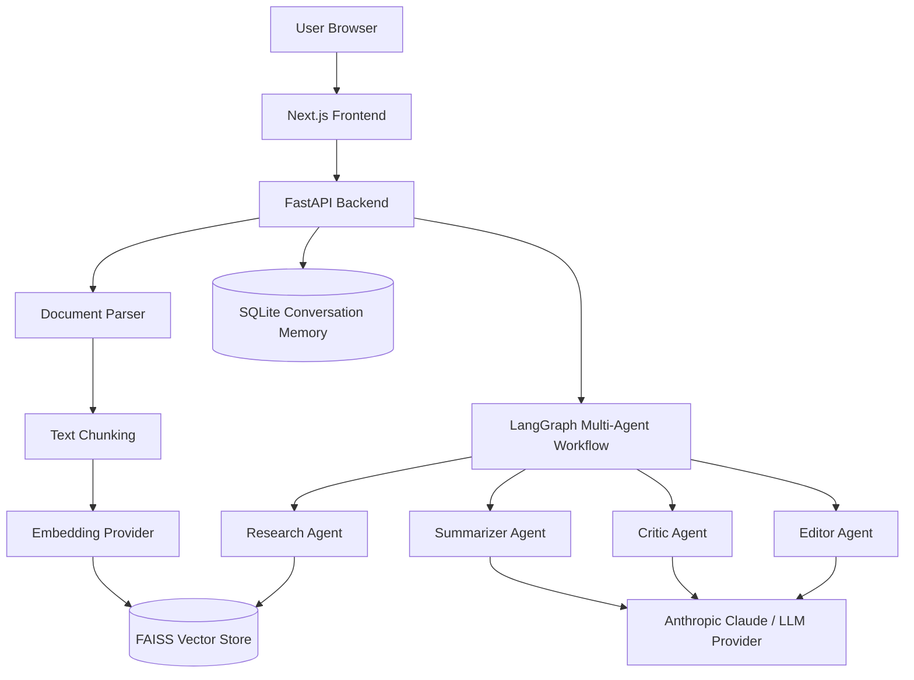
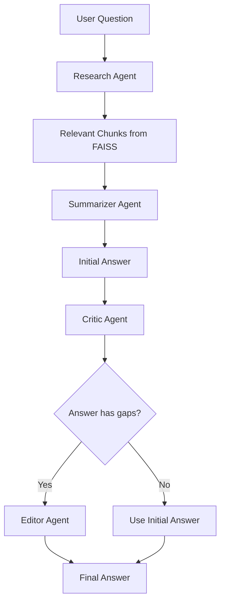
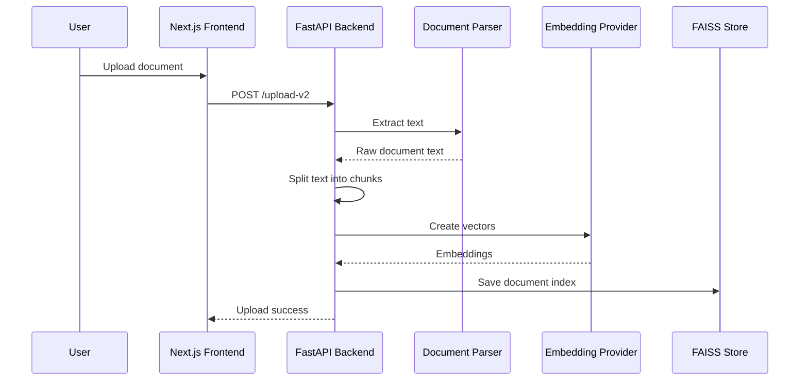
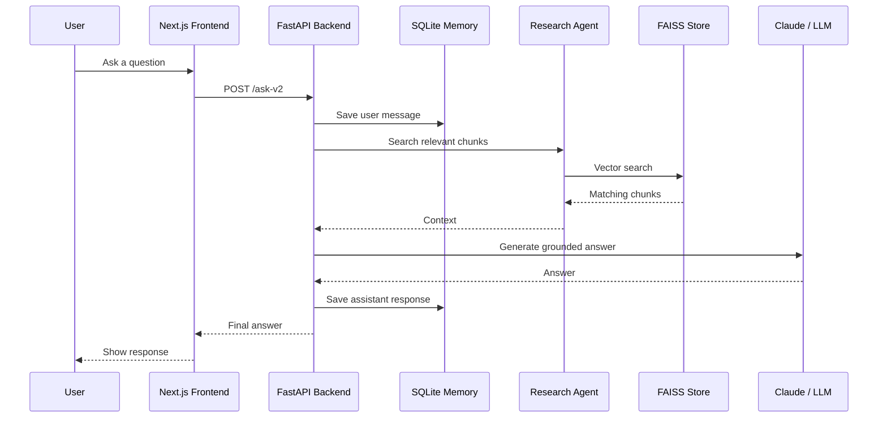

# AI Research Assistant

## 1. Short Introduction

This project is an AI-powered research assistant that lets users upload documents and ask questions about them. It uses Retrieval-Augmented Generation, also called RAG, so the AI answers from the uploaded documents instead of relying only on general model knowledge.

The system supports PDF, DOCX, HTML, and TXT files. After upload, the backend extracts text, splits it into chunks, stores searchable vectors in FAISS, and uses a multi-agent LangGraph workflow to produce a grounded answer.

---

## 2. Problem Statement

Students and researchers often work with long documents like papers, resumes, reports, manuals, and notes. Reading everything manually takes time, and asking a normal chatbot can produce answers that are not grounded in the document.

This project solves that by building a document-aware assistant. The assistant first searches the uploaded documents, finds the most relevant parts, and then asks the LLM to answer only using those parts.

---

## 3. Main Idea

The main idea is:

```text
Upload documents -> Extract text -> Store searchable knowledge -> Ask questions -> Get grounded answers
```

The project is not just a chatbot. It combines:

- RAG for document-based answering
- FAISS for vector search
- LangGraph for multi-agent workflow
- Anthropic Claude for answer generation
- FastAPI for backend APIs
- Next.js for the frontend interface
- SQLite for conversation memory

---

## 4. High-Level Architecture



### Explanation

The frontend is used for uploading documents and chatting. The FastAPI backend handles the AI pipeline. Uploaded documents are parsed, chunked, embedded, and stored in FAISS. When the user asks a question, the Research Agent searches FAISS, and the other agents generate and improve the final answer.

---

## 5. Multi-Agent Workflow



### Agents Used

**Research Agent**

Searches the selected documents using FAISS and retrieves the most relevant chunks.

**Summarizer Agent**

Creates the first answer using only the retrieved document context.

**Critic Agent**

Checks whether the answer is accurate, complete, and grounded in the document.

**Editor Agent**

Improves the answer if the critic finds gaps or unsupported content.

---

## 6. Document Upload Flow



### Explanation

Each uploaded document gets its own FAISS index. This makes multi-document search cleaner because the user can choose whether to search all documents or selected documents.

---

## 7. Question Answering Flow



---

## 8. Why This Architecture Is Good

This architecture is good because each component has a separate responsibility.

- The frontend handles user interaction.
- FastAPI exposes clean backend endpoints.
- The parser handles document extraction.
- FAISS handles fast vector search.
- LangGraph controls the multi-agent flow.
- SQLite stores memory.
- The LLM generates natural-language answers.

This makes the project easier to debug and extend. For example, if I want to add a new document type, I can update the parser. If I want to use a different LLM, I can update the LLM provider wrapper. If I want better search quality, I can switch the embedding provider.

---

## 9. Technologies Used

### Backend

- Python
- FastAPI
- Uvicorn
- LangGraph
- FAISS
- SQLite
- Anthropic Claude
- pdfplumber
- python-docx
- BeautifulSoup4
- NumPy

### Frontend

- Next.js
- React
- TypeScript
- Tailwind CSS
- Axios

### AI Concepts

- Retrieval-Augmented Generation
- Vector embeddings
- Multi-agent workflow
- Conversation memory
- Document-grounded answering

---

## 11. Summary

In summary, this project is a full-stack RAG-based research assistant. It combines document processing, vector search, multi-agent reasoning, conversation memory, and a clean web interface. The main strength is that answers are grounded in uploaded documents, and the architecture is modular enough to be extended into a production-level research assistant.
